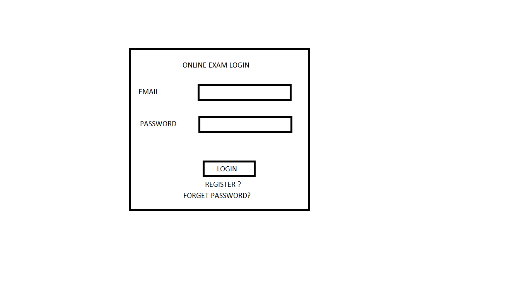
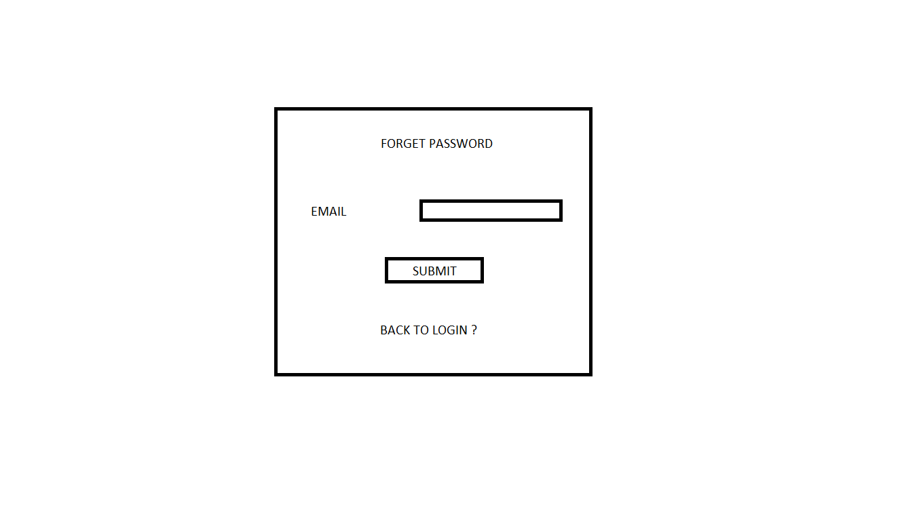
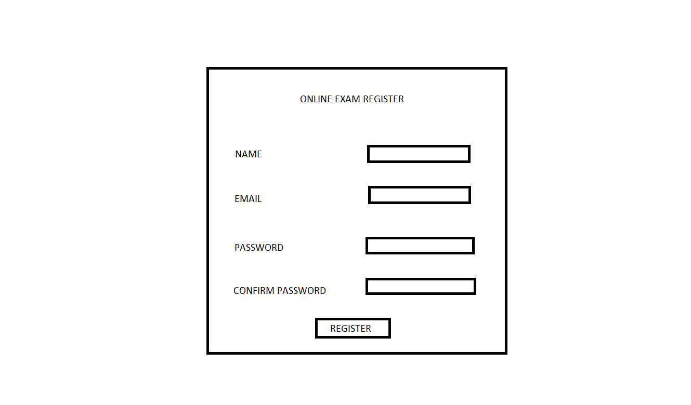
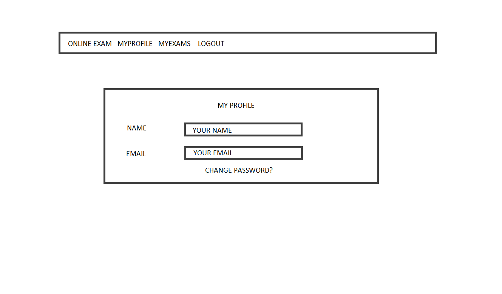
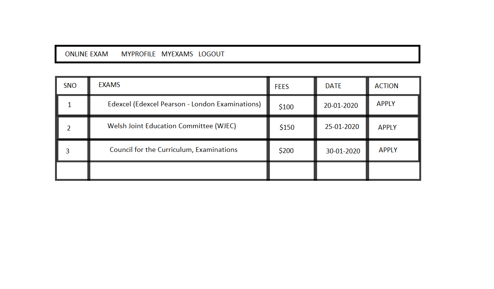
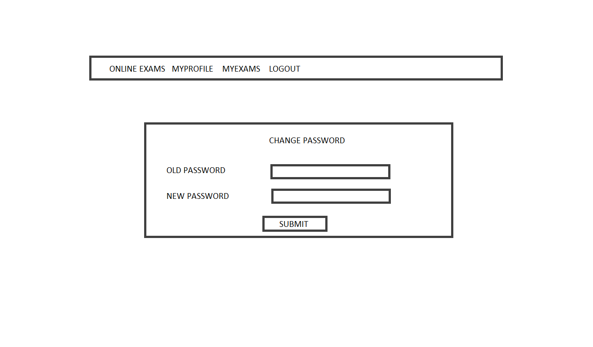
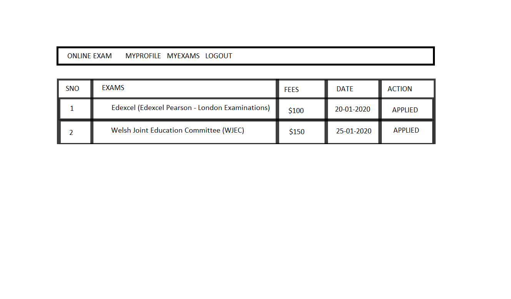
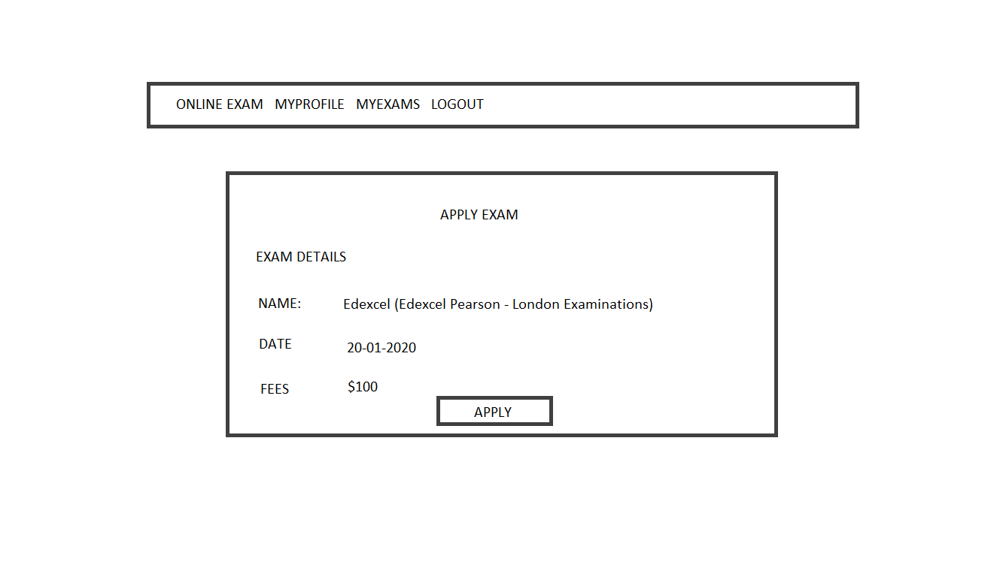
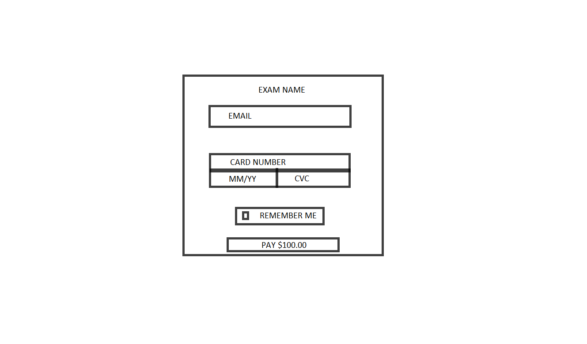

# Online Exam Registration System
		
	Online Exam Registration System is a project designed to make the Online Exam Registration 
	reliable with enhanced security. This system provides the students an efficient management 
	strategy to chose their exams. Online Exams has become a fast growing option for companies 
	because of its speed and accuracy. It needs less manpower to execute the examination. 
	
	Almost all organizations now-a-days, are conducting their exams online as it saves time for 
	students and you get results in less time. It also helps the environment by saving paper. 
	In an Online Exam Registration System, the user uses his/her email as UserId whilst 
	registering their details in the site. This user email is used to authenticate the user when 
	students login to the site.
	
## UX
	
	Online Exam Registration System is designed by implementing features from the bootstrap.css framework.
	The application was designed to work just as well on devices with small screens as those with larger ones.
	
### Login Screen



	The user will be redirected to the Login Screen while visiting the site.
	The user needs to enter their email and password to login to the Online Exam Registration System. 
	Login Screen is provied with "Register Here" and "Forgot Password ?" link for users.
	
		
### Forget Password Screen



	If the user forgot his/her password, he/she needs to click on the "Forgot Password ?" link.
	They will be redirected to the Forget Password Screen.


### Registration Screen


		
	If the user is visiting for the first time, and don't have their login credentials,
	user can register himself by clicking on the Registration Link.

### MyProfile Screen



	The user "MyProfile" screen shows the User "Name and Email".
	The screen has change password link aswell.
	
### Home Screen



        Home screen has a table with the list of following details:
	List of Exams, Fees, Dates and Status.

### Change Password Screen


		
	The user is allowed to change the password in Change Password Screen. 
	The user needs to enter his valid old password and provide a new password.

### My Exams Screen



	"My Exams" Screen has a table with the list of following details:
	List of Exams, Fees, Dates and Status.
	
### Apply Exams Screen



	The "Apply Exams Screen" shows the detail about the exam like the
	name of the Exam, fees and date of the exam, with the apply button.

### Payment Screen


		
	Payment Screen allows the user to pay for the exam fee from the Stripe account, using the following details:
	EmailId, CardNumber, Month/Date and CVC.
	
## FEATURES
	
	Existing features
		
	'Login Screen'   
		- User needs to provide login credentials i.e Email and Password.
		- If the Email is left blank while submission it will display a wrong icon. 
		- If the Email format is not correct while submission it will display a wrong icon.
				
		- If the Password is left blank while submission it will display a wrong icon. 
		- If the Password is not correct while submission it will display a wrong icon.
		  
		- If the User details are not registered it will throw the following error
		  "Error! Invalid username or password!"
		
		- If the user is registered it will redirect to the Home screen.
		
	'Forget Password Screen'.
		- EmailId need to be provided by the user to send the forgot password details.
		- If the Email is left blank while submission it will display a wrong icon. 
		- If the Email format is not correct while submission it will display a wrong icon.
		- If the EmailId doesn't exist it will throw the following error
		  "Error! Email not exists!"
		- If the User details are not registered it will throw the following error
		  "Error! Email not exists!"

		- Once the registered user provides the valid email id, it will show following message
		  "Your password is successfully sent to your email."
		  
		- Registered user will get the email with password link.
			  
		- User can click on "Click Here" link to get back to the login screen.
		  
		
	'Registration Screen'
		- User needs to provide the following details for registration:
			Name 
			Email
			Password
			Confirm Password
		
		- If any of the fields are left empty while submission it will display a wrong icon.
		- If the Email is left blank while submission it will display a wrong icon. 
		- If the Email format is not correct while submission it will display a wrong icon.
		- If the EmailId doesn't exist it will throw the following error
		  "Error! Email not exists!"
		- If the EmailId already exist it will throw the following error
		  "Error! Email already exists."
		- If the Password and Confirm Password don't match it will throw the following error
		  "Error! Passwords do not match."
		- If the user is registered successfully it will show a successful message.
		
	'MyProfile Screen' 
		- MyProfile Screen will show the following details of the user and it is uneditable.
			Name
			Email
		- The Screen has "change password" link
		
	'Change Password Screen' 
		- Change Password Screen shows the following details.
			old password 
			new password.
		- The user should enter the valid old password and provide a new password to change the password.
		
	'Home Screen'
		- Home screen has a table with the list of exams user can apply with the following details:
		  List of Exams, Fees, Date and Action.
		- Home screen has an apply button to apply for exams.
		
	'My Exams Screen' 
		- My Exams Screen has a table with the list of following details:
		  List of Exams, Fees, Date and Action.
		- This screen shows all the exams that is applied by users.
		
	'Apply Exams Screen'  

		- Apply Exams Screen will provide the following details:
		  Name, Date, Fees.
		- Apply Exams Screen will have apply button to apply for exams.

	'Payment Screen'   

		- Payment Screen will provide the following details:
		  Name, CardNumber, Card expiry Date, Cvc.
		- User need to provide the valid details to do the Stripe Payment:
			EmailId
			Card Number {4242 4242 4242 4242}
			Card expiry Date {12 / 20}
			Cvc {123}
		- Exam details will be send to the users registered email once applied successfully
		
	'Logout'        
		- Logout button is available for the user to logout the session.

	Features left to implement

		- Allow the User to take the online Exam after registration.
	
## Technologies Used

	Git : This project uses command line to do regular commits and to push the project to github
	Github : This project uses to remotely store project code and allow public to see the website
	Heroku : This application is hosted via Heroku
		
		
	Front-End Technologies:
	
	HTML : This project uses HTML to build the foundation of the web application and 
		includes links to JS, CSS, and Font Awesome.
	CSS : This project uses CSS to style the features of the web application and each 
		page of the cookbook.
	Bootstrap { Version 4.3.1 - (https://getbootstrap.com/docs/4.3.1/) }
		This project uses bootstrap for grid layout of the page.
	JQuery { Version: 3.3.1 }
		This project uses jQuery which is included with bootstrap to initialise many of the 
		bootstrap components used within the application.
	JavaScript : This project uses JavaScript for interactive functionality of the application.
	Font Awesome : This project uses Font Awesome to provide icons for the application.
		
		
	Back-End Technologies:
	
	Python { Version: 3.7.4 }
		This project uses Python to provide the backend functionality of the cookbook, 
		including functions to add, edit or delete a recipe.	
	MySql Client { Version: 1.13.4 }
		This project uses MySql Client which is a driver for MySql, used to access 
		the MySql database.
	JSON : This project uses JSON to provide the core data for the cookbook, 
		including recipes, users, categories, etc.
	Django { Version: 2.2.6 }
		This project uses the Django framework to bring the frontend and 
		backend of the application together.
	MySQL : This project uses MySQL which is used to contain the tables.
	Font Awesome : This project uses Font Awesome to provide icons for the application.
		
			
## Testing

	1) Manual Tests
	
		The feature details provided in the FEATURES section is tested Manually.
	
	2) Responsiveness Testing
	
		This application has been tested on all mobile, tablet and desktop screen sizes with 
		Google Chrome Developer Tools. From these tests, all issues have been resolved.

	3) Code Validation

		The HTML, CSS and JavaScript code for this application has been run through and 
		validated by bootstrap with JS.

## Deployment
	
The source code for this application can be found on [Github](https://github.com/maimbeeb/OnlineExam) 
and the application itself has been deployed onto Heroku [Heroku](https://lit-dusk-54430.herokuapp.com/) 
There is no difference between the GitHub code and the code in the live application. 

It can be installed with the following steps:

 - Git Clone the repository
 - Install Heroku ToolBelt
 - From your command line, enter ```heroku``` to ensure heroku is installed 

    ```
    heroku login
    ```
 - Enter your credentials for heroku.com
    ```
    pip3 freeze --local > requirements.txt
    echo web: python manage.py runserver host port > Procfile
    git add .
    git commit -m "initial commit"
    git push -u heroku master
    ```
 - Application is live at Heroku.
	
## Credits
	
	Got the Idea from Online examination system used by Companies.
	Referred to the python documentation.
	Refered to the Django docs as well which have been a huge help.
	A tutorial has been taken from Youtube.
	Many resources have been consulted online (stackoverflow, pyhton pep8, blogs, etc).
	
	Acknowledgements
	
	This project was based on a brief written by Code Institute to fulfill requirements of their 
	Full Stack Frameworks With Django!(part of the Full Stack Web Developer course).

